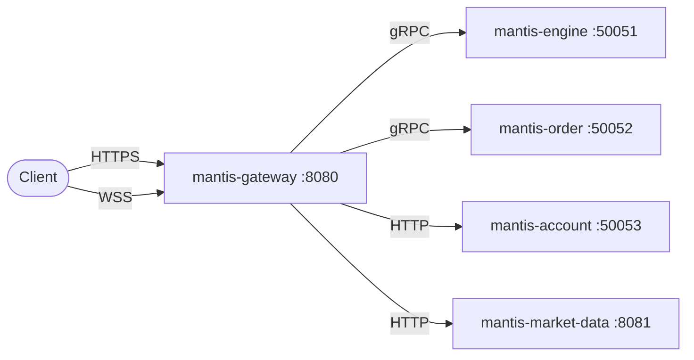

# mantis-gateway

API gateway for [Mantis Exchange](https://github.com/mantis-exchange). Routes client requests to internal microservices via gRPC, and provides real-time market data via WebSocket.

## Features

- **REST API** on `/api/v1` — orders, depth, trades, account
- **WebSocket** on `/ws` — real-time market data push
- **JWT authentication** middleware
- **API Key** authentication support
- **Rate limiting** — token bucket per IP (100 req/s)
- **Security headers** — HSTS, CSP, X-Frame-Options, CORS
- **gRPC client** — connects to matching engine, order service, account service

## Architecture



## API Endpoints

| Method | Path | Auth | Description |
|--------|------|------|-------------|
| GET | `/health` | No | Health check |
| GET | `/ws` | No | WebSocket market data |
| GET | `/api/v1/depth/:symbol` | No | Order book depth |
| GET | `/api/v1/trades/:symbol` | No | Recent trades |
| POST | `/api/v1/orders` | JWT | Place order |
| DELETE | `/api/v1/orders/:id` | JWT | Cancel order |
| GET | `/api/v1/account` | JWT | User profile |
| GET | `/api/v1/account/balances` | JWT | Balances |

## Quick Start

```bash
go build -o mantis-gateway ./cmd/gateway
MATCHING_ENGINE_ADDR=localhost:50051 ./mantis-gateway
```

## Configuration

| Variable | Default | Description |
|----------|---------|-------------|
| `PORT` | `8080` | HTTP server port |
| `MATCHING_ENGINE_ADDR` | `localhost:50051` | Matching engine gRPC |
| `JWT_SECRET` | `changeme` | JWT signing secret |
| `CORS_ORIGINS` | `*` | Allowed CORS origins |

## Part of [Mantis Exchange](https://github.com/mantis-exchange)

MIT License
